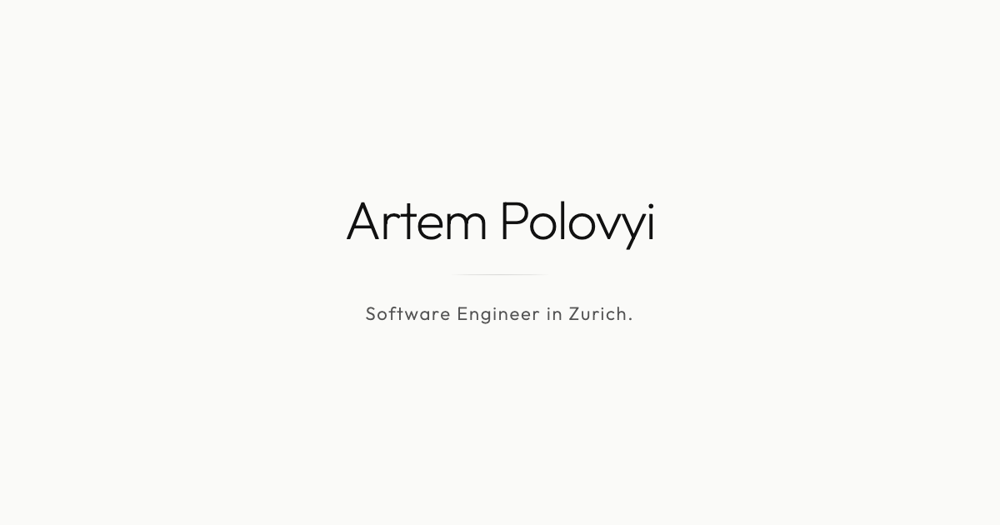

# apolovyi.me

A static, multilingual personal site presenting Artem Polovyi's enterprise engineering work and approach to reliable AI delivery.

[Visit apolovyi.me](https://apolovyi.me)



## Engineering

- Next.js 16 App Router, React 19, TypeScript, and Tailwind CSS
- Static export with localized routes for English, German, Swiss German, and Ukrainian
- Zod-validated content dictionaries checked before every build
- Responsive light and dark themes with structured metadata
- Playwright behavior tests across desktop Chrome, desktop WebKit, and iPhone emulation
- Automatic Netlify production deployments from `main`

## Delivery

GitHub Actions validates dictionaries, formatting, linting, smoke behavior, the production build, and browser-level behavior. Pull requests receive fast core coverage while non-draft changes run the complete Playwright matrix.

```text
localized content ── schema validation ──> Next.js static export ──> Netlify
                                      └──> Playwright behavior gates
```

## Local development

Requires Node.js 22 or newer and pnpm 10.

```bash
pnpm install --frozen-lockfile
pnpm dev
```

Run the repository gates with:

```bash
pnpm check
pnpm build
pnpm test:e2e
```
